# GuessCountry: LastFM Social Network's Country Prediction


## Background

In this project, the dataset contains a Graph Network where the nodes are the users (including artists) and the edges represent mutual followers relationships.

Each node has a feature which indicates the list of artists that each user liked.

But, it turns out that this feature can be converted into another type of edge of the graph network.

Hence, we have two types of edges which are "CONNECTED" (blue edges) and "LIKED" (green edges).

## Goal of The Project

For your information, each user has the country origin information.

And for this project, we would like to create a system which can predict the location of the origin.

In order to build this system, we will use Graph Neural Network that processes two types of edges.

Because we have two types of edges, we can parallalize the training process of the graph, by using Ray.

# Model Architecture

Here is the Deep Learning Model that will be used for this project:

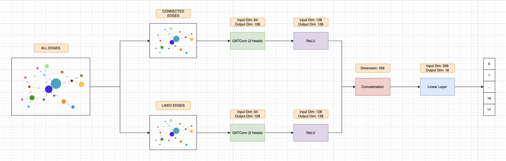

## Model Performance

We trained the model using 50 epochs and here is the loss plot

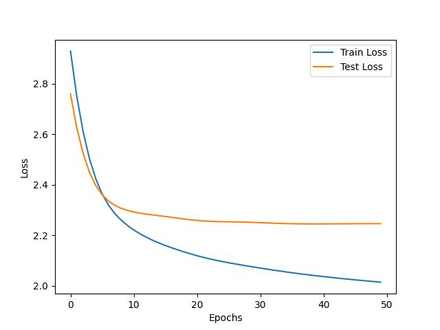

Here is the confusion matrix

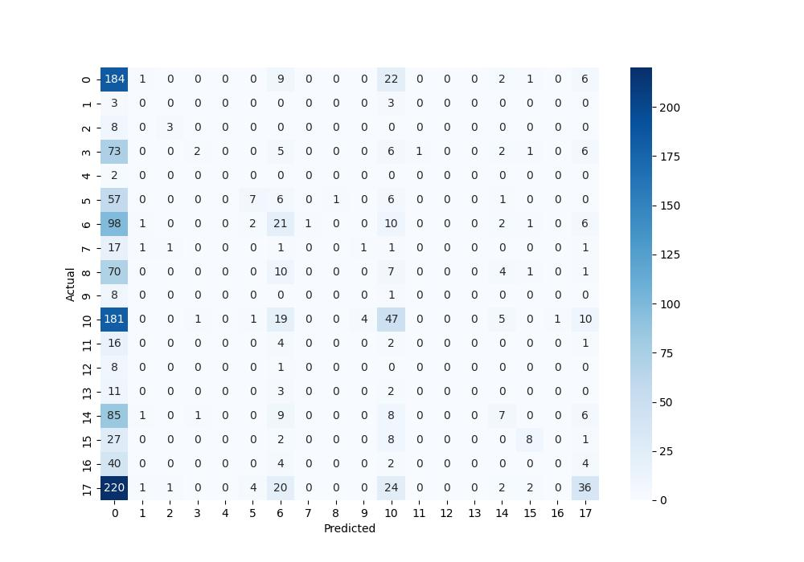

## Reasoning on Model Result

Based on the confusion matrix, it seems that the model is most capable of predicting correctly for the country (0, 6, 10, 17).

But, one potential reason why this happened is because the data contains more nodes with this country labels.

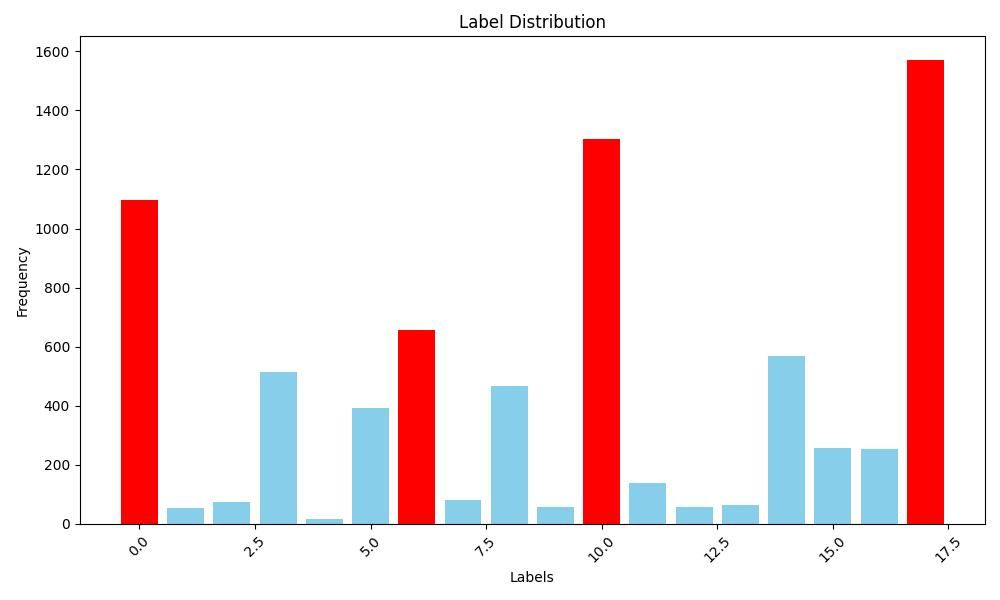

## Scaling the GNN Training with Ray on EC2

Ray is a tool that can help to parallelize your model training. In this case, the model training can be parallelized based on two types of edges, which are "CONNECTED" and "LIKED".

Take note that for this project, I will use 'ap-southeast-1' (Singapore) region for demonstration, but feel free to use any region that you want (recommended to use the one that is close to where you live in order to minimize the network communication latency).

### Make AWS Account

If you are new to AWS, you may create your account at https://aws.amazon.com/console/

### Create IAM User for Higher Security

In your AWS Management Console, search for IAM Service.

Then try to create a new user.

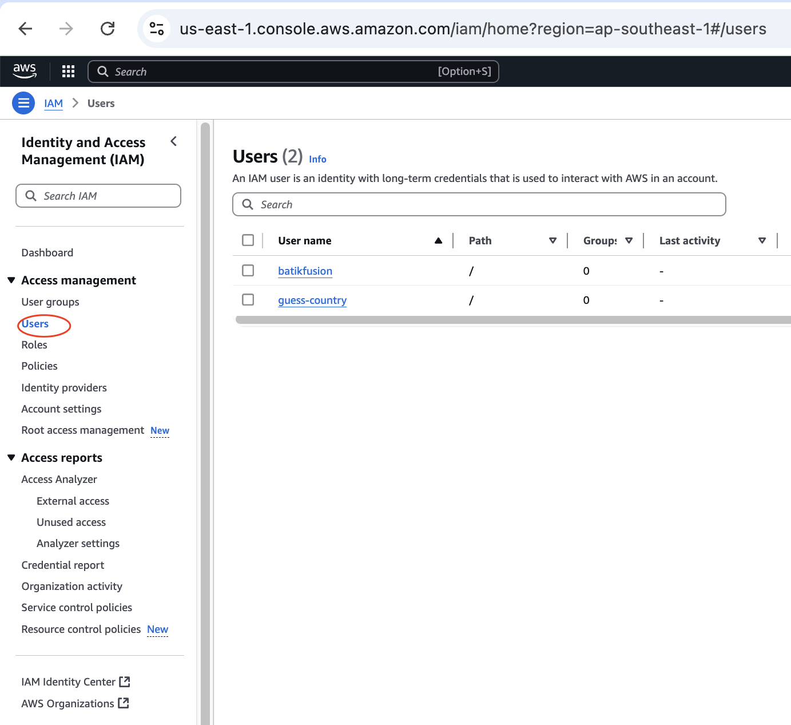

Please attach the following policies to your new IAM User.

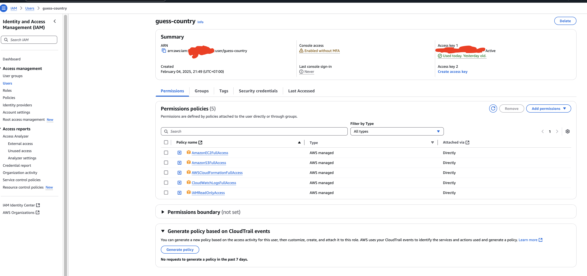

These policies allows your IAM user to utilize both EC2 and S3 services while monitoring the infrastructure usage to manage your AWS Resource efficiently.

### Create IAM Role to grant access for EC2 instance to create Ray Cluster

To create an IAM Role navigate to the following section

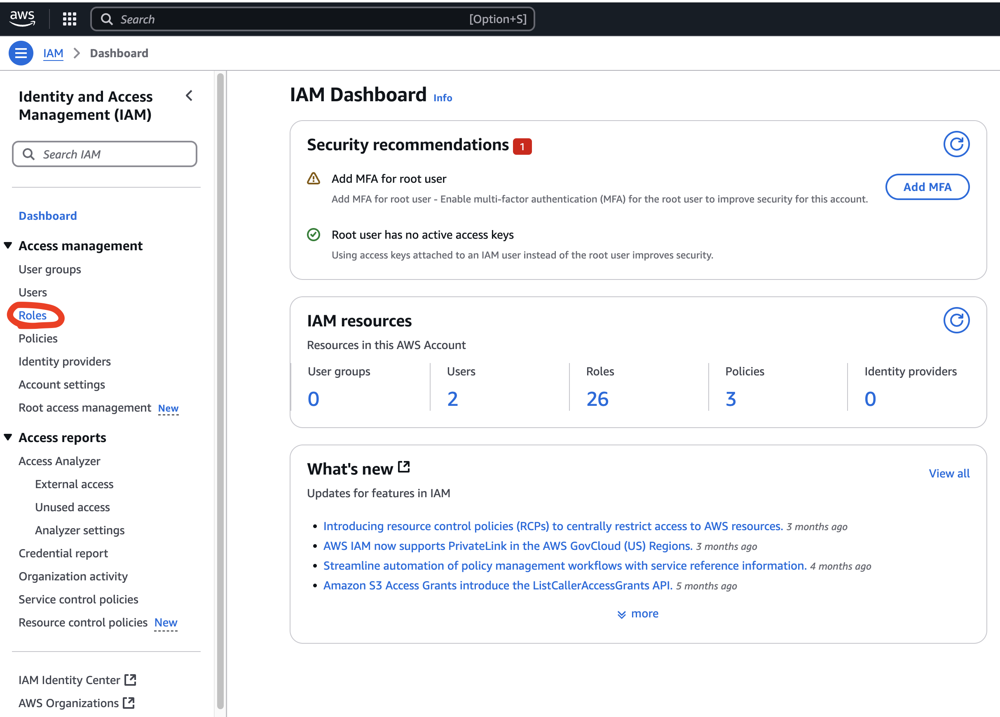

Please create a new iam role with the name of 'ray-autoscaler-v1' with the following policies attached:

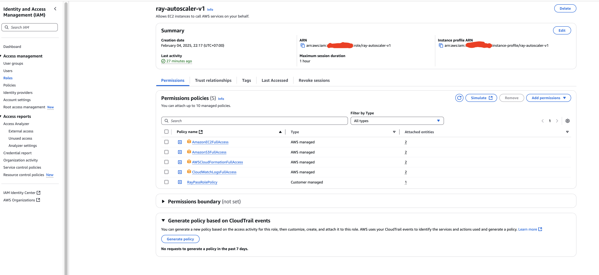

Regarding the RayPassRolePolicy, you need to create an inline policy for the role by going to this part:

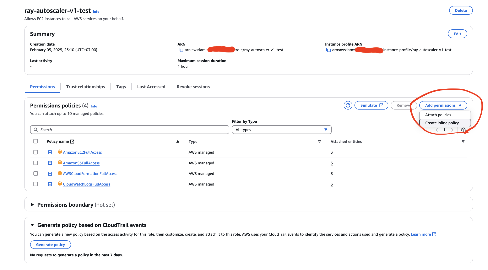

Then pick th JSON format and paste the following configuration:

```
{
    "Version": "2012-10-17",
    "Statement": [
        {
            "Effect": "Allow",
            "Action": "iam:PassRole",
            "Resource": "arn:aws:iam::*:role/ray-autoscaler-v1"
        }
    ]
}
```

### Configure AWS CLI on your Local Machine

You can first start by downloading AWS CLI to your machine respective to your operating system at https://docs.aws.amazon.com/cli/latest/userguide/getting-started-install.html

After that, please follow the instructions to configure your AWS account to the CLI using https://docs.aws.amazon.com/cli/latest/userguide/cli-authentication-user.html

### Deploy EC2 Instance using YAML File

Start by cloning this git repository using:

`git clone https://github.com/kevinchs0808/GuessCountry.git`

Make sure to have your python environment ready using the Python 3.12 version. (https://www.freecodecamp.org/news/how-to-setup-virtual-environments-in-python/)

Then run

`pip3.12 install "ray[default]"`

Once done, proceed with:

`ray up ray-cluster.yaml`

The main point of this part is that we would like to create a Ray Cluster that consists of 4 CPUs with the instance type of 'm5.xlarge'. During Ray Execution, it is required to use 2-4 CPUs to ensure proper resource utilization during parallelization.

Now, in your AWS Management Console, please fo to the EC2 Dashboard, and check if there's a new instance created like the following:

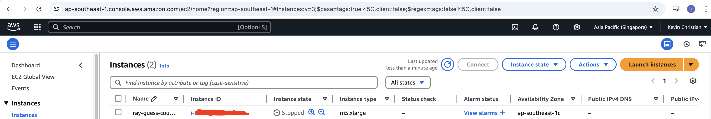

### Attach the ray-autoscaler-v1 role to the created EC2 Instance

At this moment, the EC2 Instance that you see does not have access for Ray service. Hence, you need to attach the IAM role 'ray-autoscaler-v1' that you have created previously.

This can be done by modifying the IAM role under the Security section of the instance

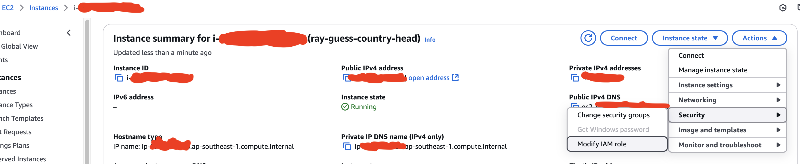

### Copy your files from local machine to the EC2 Instance using Secure Copy

In this project, you will utilize the Ray Cluster inside the EC2 instance that you have created. Therefore, you must copy the files that you have in your repository (local machine) into the EC2 instance file storage by using the following command:

`scp -i ~/.ssh/ray-autoscaler_ap-southeast-1.pem -r my_ray_gnn_bucket ubuntu@a.b.c.d:GuessCountry`

replace 'a.b.c.d' with the Public IPv4 address shown in your EC2 Instance Dashboard.

Regarding the certificate ~/.ssh/ray-autoscaler_ap-southeast-1.pem, it was automatically generated when you created the ray-autoscaler_v1 IAM role.

### Login to the EC2 Instance using SSH

Once, you have copied all the complusory files, proceed by logging into the EC2 instance in your terminal using the following commands:

`ssh -i ~/.ssh/ray-autoscaler_ap-southeast-1.pem ubuntu@a.b.c.d`

You should be able to view the following once you successfully login into your EC2 instance:

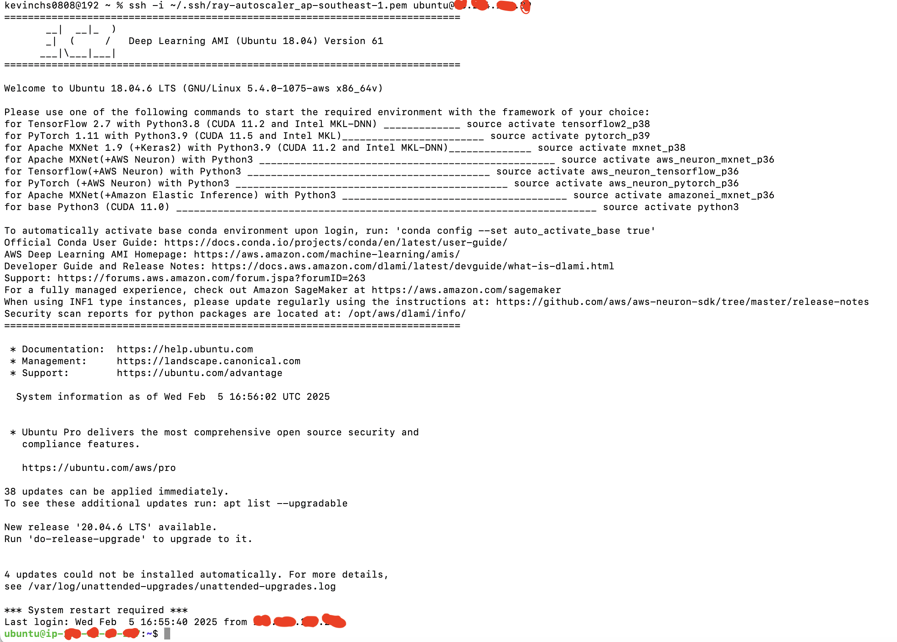

### Configure Python 3.12 Environment

Now you must configure your python environment using the version 3.12

There will be some issue, and hence please consult with ChatGPT as it can help you with resolving the issue.

Once the python environment has been created, go to the GuessCountry folder in your EC2 terminal

`cd GuessCountry`

Then install all the packages from the requirements.txt

`pip3.12 install -r requirements.txt`

### Start Ray Cluster

Once the python environment has been configured, start the ray cluster using the following command:

`ray start --head --num_cpus <num_cpus_you_want_to_try>`

Now, please check if the ray cluster has been started correctly by running the following command:

`ray status`

This should result in the following logs:

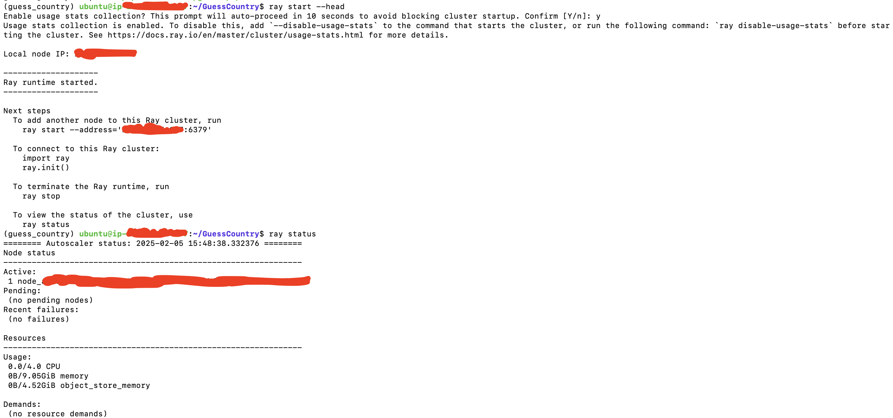

### Start Model Training on Ray

Submit training the parallelized GNN model using the following command:

`python3.12 train.py`

Eventually, you will see the following result:

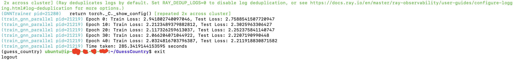

As you can see, the model training is done within 5 minutes.

## Next Step

- Finetune the layers of the Neural Network Architecture to improve the model performance

## Citation

Source of Dataset: SNAP Stanford (https://snap.stanford.edu/data/feather-lastfm-social.html)

Research Paper: B. Rozemberczki and R. Sarkar. Characteristic Functions on Graphs: Birds of a Feather, from Statistical Descriptors to Parametric Models. 2020.

Book Title: Proceedings of the 29th ACM International Conference on Information and Knowledge Management (CIKM '20)

Pages: 1325–1334

Organization: ACM
